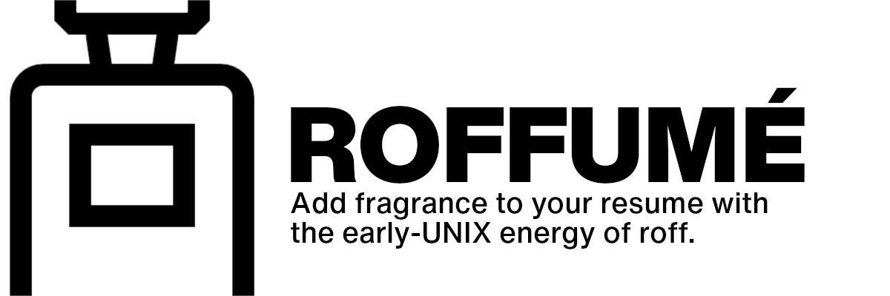
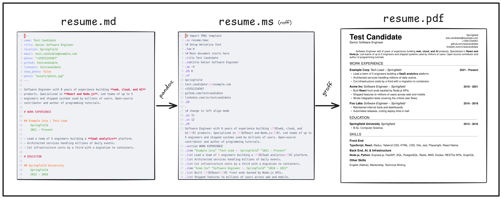
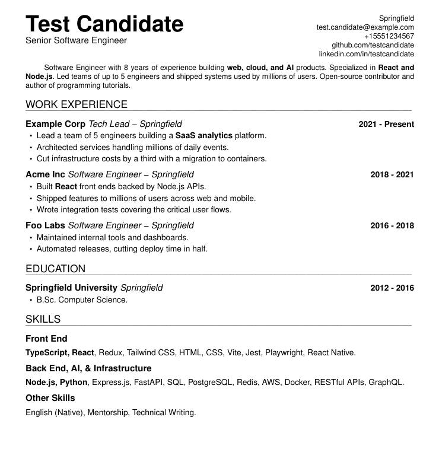

# Roffumé (_rah-foo-MEH_)


<p align="center">
  
</p>

Add fragrance to your resume with the early-UNIX energy of `roff`.

[](https://github.com/sebastiancarlos/roffume/actions/workflows/ci.yml)
[](LICENSE)

`roffume` is a text-based **resume authoring system**:

- CVs are authored in **Markdown** and compiled to one-page PDFs via a
  **Pandoc** Lua filter plus a custom **Groff `ms`** template.
- **Per-job customized copies living in their own folders** (`applications/<job>/`)
- Top-level `resume.md` is the canonical (English) source. Any extra language
  lives alongside it as `resume_<language>.md` (for example
  `resume_spanish.md`).

<p align="center">
  
</p>

`roffume` ships with a placeholder `resume.md` at the root, representing your
**main resume**. Make it yours by editing. 

Here's what the [source `resume.md`](resume.md) compiles to:
[Test_Candidate.pdf](docs/Test_Candidate.pdf).

<p align="center">
  
</p>

# Requirements

- Linux or macOS.
- `pandoc` (>= 3.5), `groff`, `poppler-utils` (for `pdfinfo`).
- A desktop PDF viewer (reached through `xdg-open` or `open`).

# Quick Start

1. Clone `roffume`: `git clone https://github.com/sebastiancarlos/roffume`
2. Edit your resume content in `resume.md` (plus any `resume_<language>.md`)
3. Preview your PDF: `make preview`
4. Once satisfied, build the PDF files: `make build`
5. Check that your PDF fits on one-page: `./verify`
6. Create job-specific version: `./new-application company-name`
7. Customize your CV further for the given application at `./applications/company-name/`
   - Note that `./new-application` symlinked the root executables to the
     application folder, to be used from there directly.
8. Generate final files, with your name on them: `./rename-pdfs`
9. Send, get hired, be happy!

We recommend that you **commit to your `roffume` folder**, so that you can
keep track of the history of all your job applications. But naturally, **don't
expose it as a public repo**.

# File Structure

```txt
.
├── applications/         # Per-job folders, each a self-contained package
├── assets/               # Shared assets (photo) symlinked into each app folder
├── filters/
│   └── resume.lua        # Pandoc filter: sections/jobs/skills/paragraphs -> .ms
├── templates/
│   └── resume.ms         # Pandoc ms template (document chrome + contact block)
├── resume.md             # CV Markdown source file (canonical, English)
├── resume_<language>.md  # Optional extra-language source (for example resume_spanish.md)
├── resume.ms             # CV roff source file (generated)
├── resume_<language>.ms  # Optional extra-language roff source (generated)
├── new-application*      # Create folder for new application
├── rename-pdfs*          # Rename the generated PDF files to include your name
├── verify*               # Check all resumes render to a single page
├── resume.tmac           # Custom macros used by the cv *.ms files
├── Makefile
└── README.md
```

# Overview

While the project does use `roff` (which makes it memeable), **`roff` is an
implementation detail**. You don't actually have to touch `roff` files.

You can think instead of `roffume` as taking markdown as input, and giving
PDFs as output. 

I consider the **biggest selling point** to be the creation of
**per-application, self-contained folders** containing all inputs, outputs,
and commands.

## Commands

### `make build`

Compiles `resume.md` and each `resume_<language>.md` to the generated `*.ms`
files with pandoc (single Lua filter `filters/resume.lua`, template
`templates/resume.ms`), then generates `resume.pdf` and each
`resume_<language>.pdf` in the root folder via `grog -U -b -ww -k`.

### `make preview`

Preview the PDF file (`resume.pdf`). It does it by rendering the PDF to
`/tmp/roffume-preview.pdf` and opening it in the platform's default viewer
(`xdg-open` on Linux, `open` on macOS).

### `./new-application`

```txt
Usage: new-application NAME [SOURCE]
  - create a ./application/NAME folder
  - move source files and scripts to new directory for tuning
```

The optional `SOURCE` (for example the job listing URL) is recorded in a
`notes.md` created inside the folder.

It also symlinks the `resume.tmac` file and the commands so they can
be used as if one were in the project folder.

This is the core aspect of the system: By easily creating individual
"applications" from a source CV, the system helps with the slightly
soul-crushing need to keyword-optimize and reorder skills for each
application.

In an application folder, work as usual: Edit the `resume.md` (and any
`resume_<language>.md`) copies, then run `make build` and `./rename-pdfs`.

### `./verify`

```txt
Usage: verify
  - check that resume.md and each resume_<language>.md render to a single page
  - uses a temporary build dir; the committed PDFs are left untouched
  - exits 1 if any PDF is more than one page
```

Runs the same `pandoc` + `grog` pipeline as `make preview` into a throwaway
directory (never touching the committed PDFs), prints each resume's page
count, and exits 1 if any run over one page. Symlinked into each application
folder by `new-application`.

## `./verify` from an editor

`verify` can be driven from an editor to catch an overflowing resume while
editing. The Neovim code below runs it in the vim buffer's focus and write
events, and shows a statusline marker (`RESUME >1 PAGE`) when it exits
nonzero:

```lua
-- ~/.config/nvim/init.vim

-- resume neovim add-on START
--   If resume doesn't fit on one page on resume write, show message.

-- On write or focus, save 'resume_warn' local buffer.
local resume_ag = vim.api.nvim_create_augroup("ResumeCheck", { clear = true })
vim.api.nvim_create_autocmd({ "FocusGained", "FocusLost", "BufEnter", "BufWritePost" }, {
  group = resume_ag,
  callback = function(args)
    local buf = args.buf or vim.fn.bufnr("%")
    local path = vim.api.nvim_buf_get_name(buf)
    if not path:match("resume.*%.md$") then return end

    vim.system({ "./verify" }, { cwd = vim.fn.fnamemodify(path, ":h") }, function(res)
      vim.schedule(function()
        if vim.api.nvim_buf_is_valid(buf) then
          vim.api.nvim_buf_set_var(buf, "resume_warn", res.code ~= 0)
          vim.cmd.redrawstatus()
        end
      end)
    end)
  end,
})

-- The %{} expression re-evaluates on every draw and reads the buffer local.
vim.api.nvim_set_hl(0, "ResumeWarn", { fg = "pink", bold = true })
if not vim.o.statusline:find("ResumeWarn", 1, true) then
  vim.opt.statusline = "%#ResumeWarn#%{get(b:, 'resume_warn', 0) ? 'RESUME >1 PAGE ' : ''}%*" .. vim.o.statusline
end

-- resume neovim add-on END
```

### `./rename-pdfs`

```txt
Usage: rename-pdfs [-n|--no-canonical-suffix]
  Rename pdf files from resume.pdf and each resume_<language>.pdf to:
    - <my-name>_ENGLISH.pdf (canonical resume.md)
    - <my-name>_<LANGUAGE>.pdf (each extra language, endonym suffix)
```

Your name is derived from the `name:` field in `resume.md` front matter
(spaces become underscores). The toolchain assumes the canonical `resume.md`
is English, hence the `_ENGLISH` suffix; `-n` drops it on the canonical
resume (for jobs taking a single file). Extra languages always keep their
suffix.

Generates the final file to be sent to the employer (with any further change
for later exploration without affecting the to-be-sent files).

# Authoring Resumes

## Markdown source (`resume.md`)

- Personal information (name, title, location, email, phone, github, linkedin,
  plus optional page margins (`margin-top`/`margin-left`/`margin-right`/
  `margin-bottom`) and an optional photo (`show_photo: true` + `photo: <path>`)
  lives in the YAML front matter; the template feeds it into the contact
  block.
- Photo should be square-ish: The layout is tuned for a ~1:1 photo.
  - _Photo hack note_: In groff, a picture is glued to the text baseline and
    you can't move it up. And a picture hangs lower than text of the same
    line, because text "peaks" above its baseline but a photo does not. So to
    make the photo sit level with the name, photo builds quietly shrink the
    top margin by 0.3i (see `templates/resume.ms`).
    - Yes, this is the sort of stuff why `roff` is not _that hot_ in 2026.
- A top-level `#` heading becomes a `.section` and marks the section's layout
  (for example `# WORK EXPERIENCE`).
- In any non-skills section, each `##` heading pairs a company and role with
  a pipe - `## Example Corp | Role` - followed by an indented two-line block
  with the place and dates, then the bullets. It becomes an
  `.item "Company" "Role \- Place" "Dates"` plus `.list` lines:

  ```
  ## Example Corp | Software Engineer
      Hamburg, Germany
      2019 - 2024

  - Architected a hamburger delivery system...
  ```

- Skill categories are grouped under a `# SKILLS {#skills}` section as
  `## Category` headings each followed by one comma-separated paragraph.
- An empty `::: {.pagebreak}` div inserts a page break (`.bp`).
- Bold/italic inside bullets, skills and the summary are passed through to
  groff font escapes by the filters.

## Custom Resume Macros (`resume.tmac`)

Adapted from <https://github.com/wlcsm/resume>.

### `.title "Text for Title"`

Sets the main title of your resume. Typically your name.

### `.subtitle "Text for Subtitle"`

Sets a subtitle. Meant to be used right after the `.title`. Often your job
title.

### `.section "SECTION NAME"`

Creates a major section, with an underline. (for example, "Experience")

### `.item "Company" "Role \\- Place" "Dates"`

Creates a structured entry with three parts, produced from each `## Company |
Role` heading and the indented two-line block (place, then dates) under it:

- Company (bold)
- Role and place, joined with an em dash (italic)
- Date range (bold, right-aligned) (optional)

To omit arguments, just pass a space `(" ")`

### `.list "List item text"`

Creates a bulleted list item. Meant to be placed within an `.item`.

# F.A.Q.

## Why `roff`? Why not `LaTeX` or `typst`?

No reason, I just wanted to flex. Also, I believe `roff` still in 2026
generates PDFs faster than any other markup system by _a couple of
milliseconds_. So one must respect the early UNIX gurus.

Again, users of `roffume` can **consider `roff` an implementation detail** and
ignore it entirely. The main benefit of `roffume` is the creation of
**per-application, self-contained folders** containing all inputs (markdown),
outputs (PDFs), and commands.

## Why Markdown source instead of just `roff`?

I had an unreleased version of this project running `groff`-only for quite
some time.

After using it for 25 or so applications, I got the feeling that having
markdown as the "source of truth" was slightly easier for reading, editing,
and diffing different versions. I’ve been using it with Markdown as a base and
I’m happy with the results.

To me, Markdown wins on ergonomics: easier to visually scan, no escaping of
typographical marks (the `\-` hyphen), and syntax highlighting in every editor
for bold/italics and so on.

I do concede that raw `roff` produces better "one-per-line" diffing on what
would otherwise be inlined paragraphs. But that seems somewhat minor to me.

Also, I invite more advanced `roff` users to show me the error of my ways on
my reasoning above.

## Is the generated PDF parseable by ATC?

You probably meant ATS (ATC means "Air Traffic Control"). But in both cases,
the answer is **yes** (and it can be verified by `pdftotext`).

## Are you ok?

I believe I am, yes.

# License

MIT
